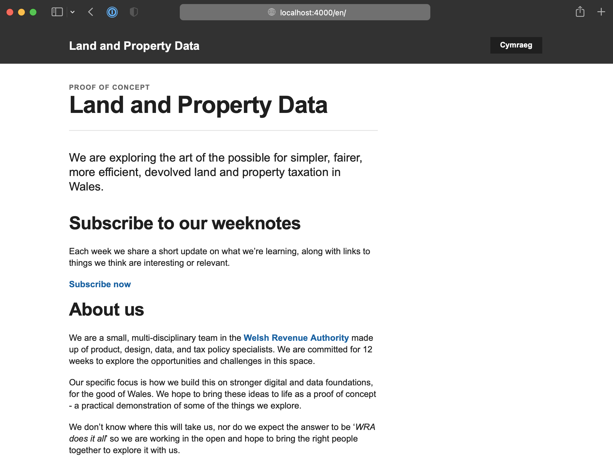

# 📝 Weeknotes #1 - land and property data proof of concept

Hi all,

Thanks for joining our ‘show and tell’ earlier, and welcome to the first week notes for the land and property data proof of concept. In future, we are hoping to share these more widely, but for now it’s just for the people who came to the show and tell.

A reminder that we are exploring the art of the possible for simpler, fairer, more efficient, devolved land and property taxation in Wales. We want to be ambitious, but humble, and:

* Bring the opportunities and challenges to life
* Give Ministers potential policy options
* Be clear about the scale of ambition and where to start
* Demonstrate new ways of working

## Getting setup ...

We have set ourselves up to work to a weekly rhythm, planning our weeks work on a Tuesday and then sharing progress at our Monday show and tells. Show and tells are a chance for the team to demonstrate work completed and get feedback, and a chance for collaborators or supporters to ask questions and suggest direction.
To plan and manage our work we are using an agile tool called Trello. If you’d like access to it, just let us know and we can give you access.
We are working on building out the team
We have been doing some desk research into pre-existing work so that we don’t duplicate good stuff that’s already been done, plus documenting policy intent around property taxes.

## Vision...

We have done a first draft of a diagram to explain the scope and ambition of the project, which we shared at show and tell. Any and all feedback is welcome.

## Working in the open...

We held a workshop on identifying stakeholders and Neil has worked that into a plan for who we engage with over the coming weeks.

Once those conversations have happened, we are aiming to start working in the open. We’ve created a ‘starter for 10’ single page website similar to how many other public sector digital projects do. We’ll use that as a starting point to discuss what we might want to put out in public.

## Focus for next week...

From the kick-off we know that the project will need to show what data might need to be in place to meet the near-term need of localised LTT. The focus of next week is to start to explore that space. We’ll be creating a couple of worked examples of LTT as it is today, and as it might be with more geographic variability.

If you have thoughts on that, or anything else we’ve done this week, please let us know.
