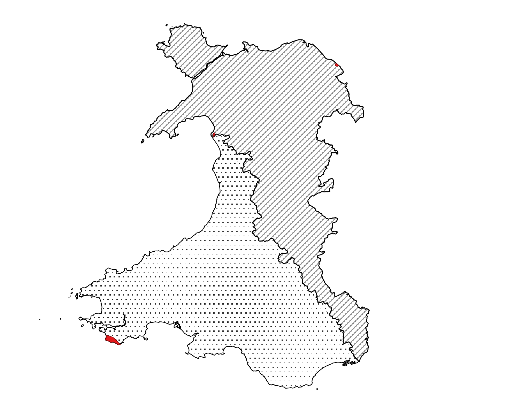
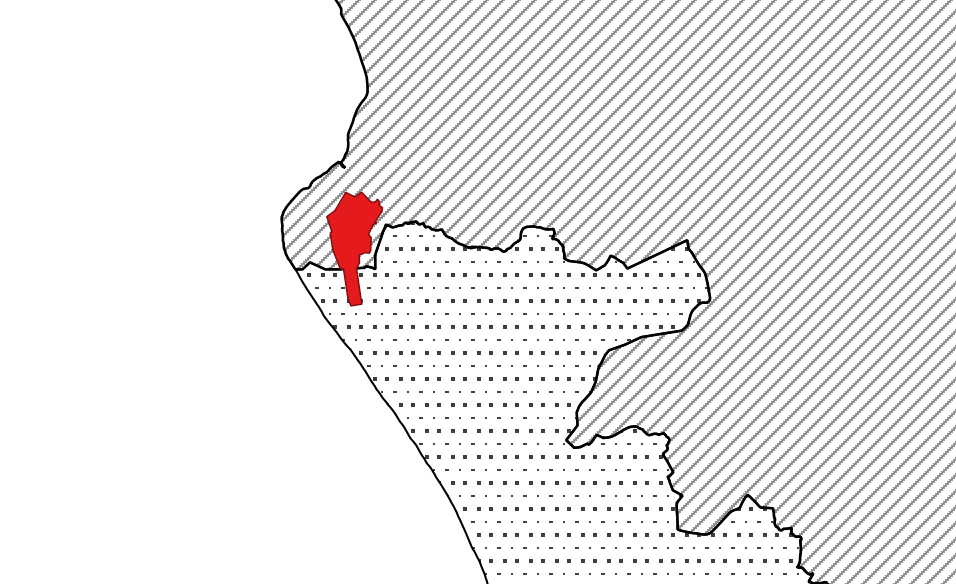

# 📝 Weeknotes #6 - land and property data proof of concept

Hello and welcome to week 6 of the _land and property data proof of concept_,

A reminder that we are exploring how the WRA can support geographically varied land and property taxes and if a data platform for land and property in Wales could also be the foundation for something more. We want to:

* Bring the opportunities and challenges to life
* Give Ministers potential policy options
* Be clear about the scale of ambition and where to start
* Demonstrate new ways of working

 📒 Scenarios

We have been [documenting some hypothetical scenarios for a localised Land Transaction Tax](https://github.com/welsh-revenue-authority/LTT_scenarios/tree/main). The scenarios use a [particular, ‘Given, When, Then’,](https://cucumber.io/docs/gherkin/reference/) that can be read as English, but also used automatically to test our software, meaning we can test the rules as code. These do not represent the policy, [there is an open consultation on that](https://gov.wales/second-homes-local-variation-to-land-transaction-tax-rates), they are a way of use verifying that we are designing the data platform in as flexible was as possible.

So far we only have a few scenarios, but will add more over time as the platform gets more complex.

🗺 Fictional test locations

To test our rules, we need some examples. To make it clear that we are firmly in the realm of the hypothetical, we are going to use some test locations.

We have created two hypothetical tax zones: North East and South West. The boundaries of the zones are arbitrary, although they do follow ward boundaries.   They were made using the [Boundary-line dataset](https://www.ordnancesurvey.co.uk/business-government/products/boundaryline) and follow the [OSGB grid](https://en.wikipedia.org/wiki/Ordnance_Survey_National_Grid).

Tax zones would never actually look like that, but it’s a great way for us to test.

We have also created three fictional places: Pontypandy, Upper Leadworth and Cwmderi (taken from the Wikipedia page [Fictional Populated places in Wales](https://en.wikipedia.org/wiki/Category:Fictional_populated_places_in_Wales)). They are all located on three pieces of military (or ex military) land. For the purposes of our test, we’ll be using the UPRN property identifiers in those areas as if they were residential properties.

Each place lets us test a particular set of scenarios. For example ‘Pontypandy’ is   split between two tax zones. ‘Upper Leadworth’ borders England.

🗺 Stakeholder and user mapping

This week, we held a couple of workshops to revalidate our understanding of the types of users of a future land and property platform. We also started thinking about the range of services those users might. For example, when might a calculation for LTT be surfaced on an estate agent’s website such as RightMove or Zoopla?

We also held really helpful conversations with ONS and Geoplace, LGF colleagues in Welsh Government and had an interesting and informative conversation with the WRA Board. We picked up lots of learning the previous sprint talking to Welsh Treasury policy people and Welsh Government data analysts.

All of this engagement helps us tests our assumptions, find out what other people are doing, and almost always reveals new policy areas, new data, and new people to talk too, so huge thanks to everyone who has given up time.

🗓 Focus for next week

We have a couple of themes from last sprint to continue to focus on:

* Can we calculate a (hypothetical) localised LTT for ~ 100 properties
* How might we present localised LTT to end users?

🗞 Blog post and team website

A reminder that the team website is [here](https://welsh-revenue-authority.github.io/property-data-poc/cy/) and the data landscape catalogue is [here](https://welsh-revenue-authority.github.io/data-landscape/).

📑 Things we found along the way this sprint…

* [ OSM UK Address Points ](https://github.com/russss/osm-uk-addresses)
* [Benefit Eligibility: Rules as Code](https://beeckcenter.georgetown.edu/wp-content/uploads/2022/02/Benefit-Eligibility-Rules.pdf)
* [Land Registry systems map sketch by psd](https://www.flickr.com/photos/psd/14303042970)
* [Customer Payment Platform revolutionises payments experience](https://www.digital.nsw.gov.au/article/customer-payment-platform-revolutionises-payments-experience)
* [The shape of Alpha (Flickr place names)](https://code.flickr.net/2008/10/30/the-shape-of-alpha/)
