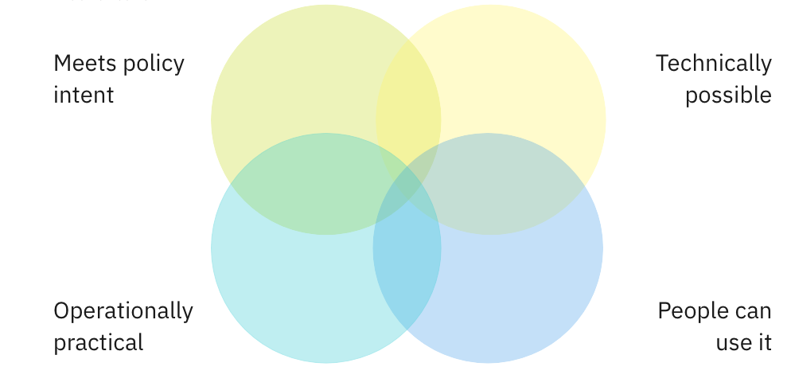
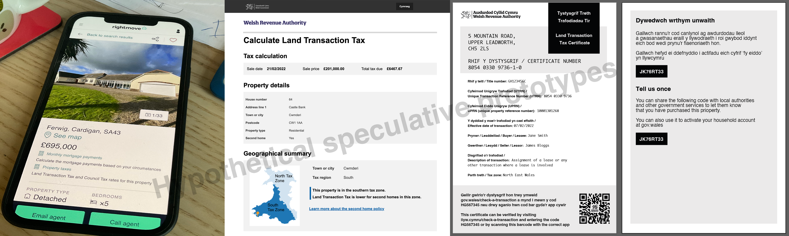

# 📝 Weeknotes #7 - land and property data proof of concept

Hello and welcome to week 7 of the _land and property data proof of concept_,

A reminder that we are exploring how the WRA can support geographically varied land and property taxes and if a data platform for land and property in Wales could also be the foundation for something more. We want to:

* Bring the opportunities and challenges to life
* Give Ministers potential policy options
* Be clear about the scale of ambition and where to start
* Demonstrate new ways of working

🧮 Calculations

[Last sprint](2022-02-28) [we created a set of hypothetical test properties to test some some hypothetical scenarios for a localised Land Transaction Tax](https://github.com/welsh-revenue-authority/LTT_scenarios/tree/main). 

One aim we had this week was to see if we could systematically calculate the correct set of tax rates for those properties based on their location. To do this we used the X/Y location of property from the UPRN dataset to determine which tax zone a property is in. (As we understand it) this is the same approach as how local authorities determine which ward people should be registered to vote in - if the X/Y coordinates for your address are in Ward A, then you are registered to vote in Ward A, regardless if part of your back garden is in Ward B.

We also started experimenting with using the '[extent](https://wiki.openstreetmap.org/wiki/Property_extents_in_the_United_Kingdom)' of the land associated with a property. Technically these could be used to calculate the percentage of a property in each tax zones a property is (in situations where properties cross boundaries), although there will likely be implementation issues with that approach.

📲 User experience and policy intent

The other aim we had this week was to think about how localised taxes might be presented to users and the type of services that might be built on top of it. We did this, not to design an end-to-end version of those services, but to identify the implications for the data platform. That's because, on a proof-of-concept like this, we are trying to balance four things:

We prototyped three things:

1. How localised taxation data from the platform might appear on a commercial property search website when people are deciding where to buy
2. How localised taxation data might appear on a government tax calculator 
3. Opportunities to use the current LTT certificate as a trusted jumping off point for other services, such as proof of ownership or property accounts

A reminder: we are not designing the services themselves, they are just tools to help us think through the problem and the policy is still out to consultation. They also help us to explain the idea of platforms supporting multiple services, identifying where hard design problems might lie and helped us think about hypotheses for future research and we imagine using these as stimulus material for that.

🗺 Stakeholder engagement

This week, we've had meetings with the Office for National Statistics and HM Land Registry, plus positive meetings with different policy colleagues in Welsh Government to discuss the platform approach. We also met with the [Digital Land team](https://github.com/orgs/digital-land/repositories?type=all) from the UK Department for Levelling Up, Housing & Communities about how they model location data in a way that allows for uncertainty and many [many-to-many data relationships](https://en.wikipedia.org/wiki/Many-to-many_(data_model)) between things like addresses, land ownership, use and ownership.

🗞 Blog post and team website

We published a blog post on [what we mean by a data platform](https://welsh-revenue-authority.github.io/property-data-poc/en/2022/03/02/what-do-we-mean-by-a-data-platform.html).
A reminder that [the team website is here](https://welsh-revenue-authority.github.io/property-data-poc/cy/), [the data landscape catalogue is here](https://welsh-revenue-authority.github.io/data-landscape/) and [previous weeknotes are here ](https://welsh-revenue-authority.github.io/weeknotes/property-data-poc/).

🗓 Focus for next week

Each week, we set out what we want to learn or do, and what hypotheses we think we need to test. This week, we are hoping to ...

* Understand how to store new data in the platform (provenance, identifiers and uncertainty etc)
* Understand issues of properties near tax zone boundaries
* Describe some research hypotheses
* Prep workshops for a second policy area the platform might need to serve

📑 Things we found along the way on this sprint…

* [AllThePlaces is an open-source effort to scape business premises data from public websites](https://www.alltheplaces.xyz/)
* [I think I’ve found my new favorite example of working in the open](https://twitter.com/gilest/status/1499127239790809088?s=21)
* [FastAPI framework](https://fastapi.tiangolo.com)
* [Policy design patterns that help you use data to create impact](https://theodi.org/article/policy-design-patterns-that-help-you-use-data-to-create-impact/)