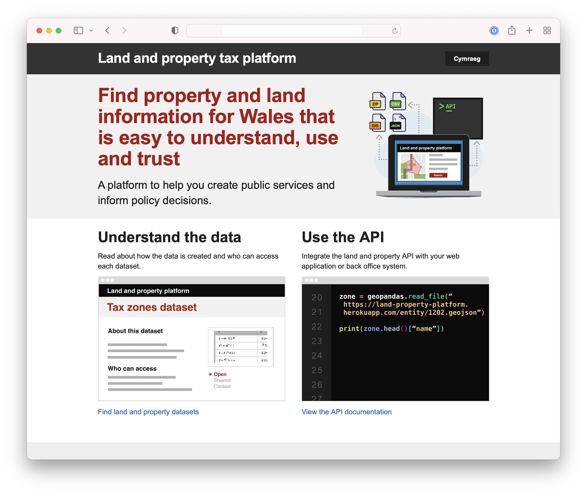
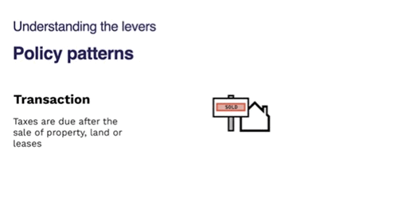

# 📝 Weeknotes #8 - land and property data proof of concept

Hello and welcome to week 8 of the land and property data proof of concept and thanks to those of you who joined our show and tell on Monday.

A reminder that we are exploring how the WRA can support geographically varied land and property taxes and if a data platform for land and property in Wales could also be the foundation for something more. We want to:

- Bring the opportunities and challenges to life
- Give Ministers potential policy options
- Be clear about the scale of ambition and where to start
- Demonstrate new ways of working

🧱 Prototype platform and landing page

We’ve taken the common line tool we shared last week to calculate which tax zone a property is in, and implemented it as an API. We hosted it on Heroku and used the FastAPI framework to create the API end point and associated documentation. As with the previous example, we are using made up properties to test some hypothetical scenarios for a localised Land Transaction Tax.

We also created a landing page for the platform using the UK government’s Department for Levelling Up, Housing and Communities’ [Digital Land platform](https://www.digital-land.info) as a template. The resources were [available on GitHub using an open licence](https://github.com/digital-land/digital-land.info).  

The words to describe the platform are probably wrong for the exact context what we are designing for, but they start from something that has been designed and researched in a similar context. It’s a shortcut to help us think about how we explain the proposition and something we can use as as a starting point for user research.

🥼 User research with internal users

We’ve kicked off some user research with potential users of the platform - teams building public facing services. More on that next week when we have done the first round. We think that will complement all the stakeholder conversations we’ve had so far (14 and counting), which have been much more about explaining the work and building understanding about what’s already out there.

📐 Policy patterns

Partly as a result of the stakeholder work, we have been thinking about how to explain the potential policy options that a platform might enable in the future. Our answer to that has been policy design patterns:

They are basically a way of us checking our own understanding of what we think we’ve heard, and explaining the types of options that a platform might open up. In that sense, they are a sort of [boundary object](https://en.wikipedia.org/wiki/Boundary_object).

🗓 Focus for next week

Each week, we set out what we want to learn or do, and what hypotheses we think we need to test. This week, we are hoping to …

- Iterate our the API design of our prototype platform and add more data points
- Decide on what our focus will be for upcoming sprints on tourism 
- User research with internal users using our prototype platform as a stimulus

📑 Things we found along the way on this sprint …

-  [The UPRN lifecycle](https://static.geoplace.co.uk/downloads/The-UPRN-lifecycle-V3-2015.pdf)
- [The Open Data Institute: data spectrum](https://theodi.org/about-the-odi/the-data-spectrum/)
- ["6.3 square kilometers of Bristol lies within Wales"](https://twitter.com/russss/status/1305190001500708864?s=20&t=djMlFsMwEk1vrBFXrmz_5g)
-  [Vale of Glamorgan’s My House service](https://myvale.valeofglamorgan.gov.uk/myCouncil.aspx)
