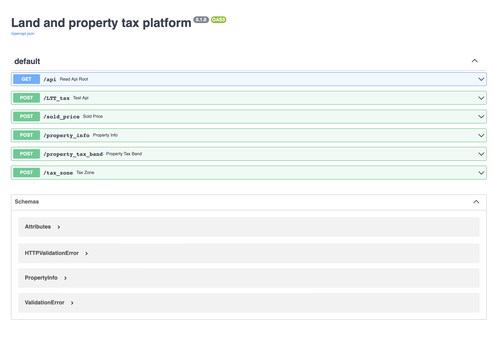

📝 Weeknotes #9 - land and property data proof of concept

Hello and welcome to the end of week 9 of the land and property data proof of concept and thanks to those of you who joined our show and tell on Monday.

A reminder that we are exploring how the WRA can support geographically varied land and property taxes and if a data platform for land and property in Wales could also be the foundation for something more. We want to:

- Bring the opportunities and challenges to life
- Give Ministers potential policy options
- Be clear about the scale of ambition and where to start
- Demonstrate new ways of working

🧱 Iterating the prototype platform

We iterated the platform API to add a few more end-points. They are not finished yet, but all helps to build a picture of how a platform might operate.

🥼 User research with internal users

We did a round of user research with two types of potential user of the platform - service delivery teams and data analysts. We heard about the importance of ease of use and data quality. We know that we need to do some more work on the proposition so that it is clear what the platform might do and what it might not.

🏕Tourism workshops

We held a workshop with policy teams working on [tourism related policies](https://gov.wales/next-step-development-tourism-tax) to understand how land and property data might support their work.

🗓 Focus for next week

Each week, we set out what we want to learn or do, and what hypotheses we think we need to test. This week, we are hoping to …

- Iterate APIs and explanation based on user research
- Continue user research
- Establish if there is value (or not) in a platform approach to support emerging policies around tourism

📑 Things we found along the way on this sprint…
- [A example of a public roadmap (for GOV.UK Sign In)](https://twitter.com/myddelton/status/1503315207279497220?s=21)
- [Frictionless data](https://specs.frictionlessdata.io)
