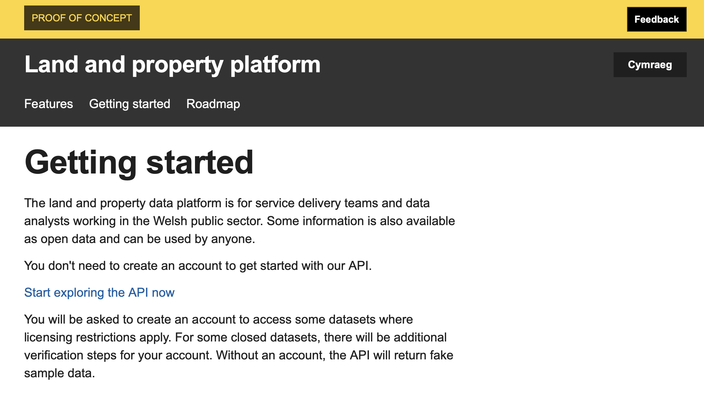
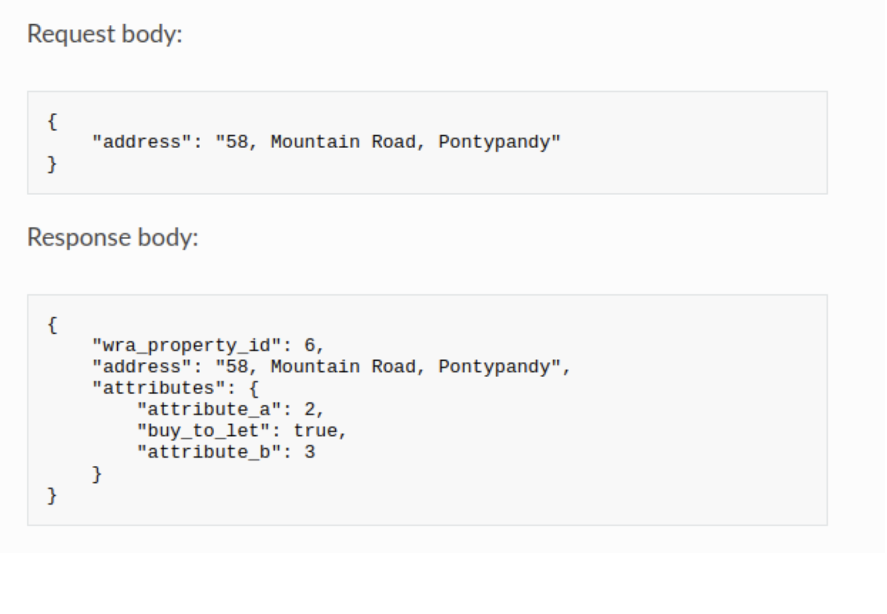
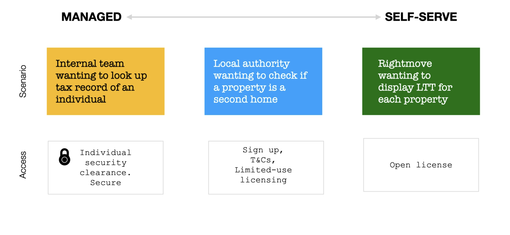
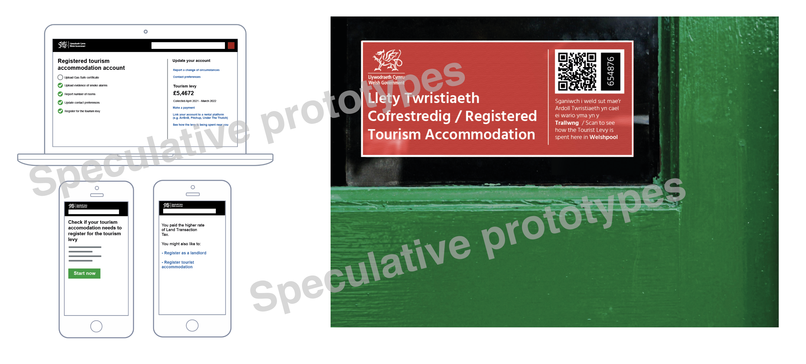
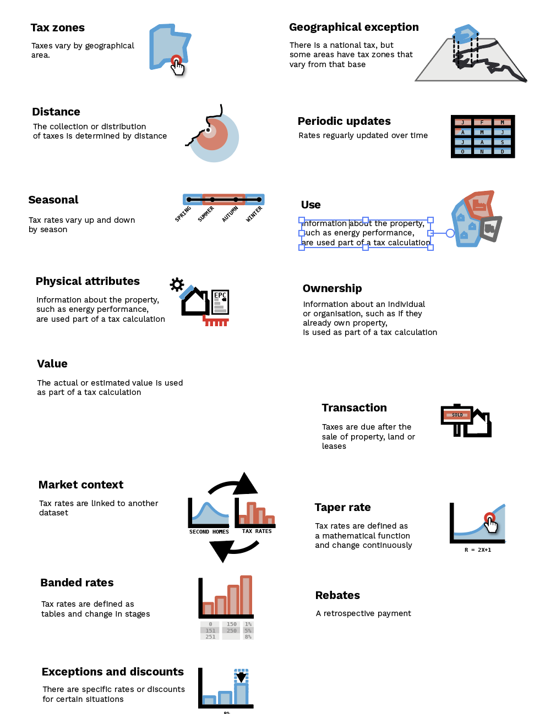

📝 Weeknotes #10 - land and property data proof of concept

Hello and welcome to the end of week 10 of the land and property data proof of concept and thanks to those of you who joined our show and tell on Monday.

A reminder that we are exploring how the WRA can support geographically varied land and property taxes and if a data platform for land and property in Wales could also be the foundation for something more. We want to:

- Bring the opportunities and challenges to life
- Give Ministers potential policy options
- Be clear about the scale of ambition and where to start
- Demonstrate new ways of working

⌨️ Making the words do the work - documentation to explain the platform

Following from the research last week, we've been putting some effort into how the platforms explains what it does and who it is for. We've also been borrowing lots of best practice from the likes of [GOV.UK Pay](https://www.payments.service.gov.uk), [Cloud.gov](https://cloud.gov) and [pagopa.gov.it](https://www.pagopa.gov.it) (good platforms explain what they do and lower the barrier to getting started). We've added the following sections: features, getting started and roadmap. We've also added a section for analysts so it is clear it is a source of data, not a replacement for data science tools.

🧩 Data model and API

We've been moving towards a data model that is less opinionated and can handle ambiguity and uncertainty, and can expand over time. 

We've also been using the Open Data Institute's [data spectrum](https://theodi.org/about-the-odi/the-data-spectrum/) as a starting point for how we think about data access. Some data, such as tax payer data would never be accessible via a platform and would remain closed. In the future, some data might be shared with local government. While other datasets, such as tax rates, would be avaliable via the platform as open data.

🏕 Tourism speculative prototyping

Following the tourism workshop last week, we did some early speculative prototyping. The aim was to help to illustrate the role of a platform and the types of services it might support. As with localised Land Transaction Tax, it seems we can usefully surface the information in different places.

A reminder: we are not designing the services themselves, they are just tools to help us think through the problem. Policies around tourism are [still under early development](https://gov.wales/next-step-development-tourism-tax). They also help us to explain the idea of platforms supporting multiple services, identifying where hard design problems might lie and helped us think about hypotheses for future research and we imagine using these as stimulus material for that.

📜 Policy patterns

Finally, we held a workshop to review the policy patterns we developed the other week. One piece of feedback was to explain them in the context of the [principles for Welsh taxes](https://gov.wales/sites/default/files/publications/2018-10/tax-policy-framework.pdf).

🗓 Focus for next week

Each week, we set out what we want to learn or do, and what hypotheses we think we need to test. This week, we are hoping to …

- Continued research with service delivery teams to understand how they would use a platform
- Explaining the open-shared-closed data spectrum as part of the platform documentation
- Iterate the API and build some example services on it

📑 Things we found along the way on this sprint…

- [Air BnB's City Portal](https://news.airbnb.com/cityportal/)
- [Lower energy bills for people near wind turbines considered](https://www.bbc.co.uk/news/uk-politics-60864097)
- [OECD's Designing and delivering public services in the digital age](https://goingdigital.oecd.org/data/notes/No22_ToolkitNote_DigitalGovernment.pdf) which includes a section on common components and platforms: "invest for the long-term in common components and tools"
- [Genomics England's research environment](https://www.genomicsengland.co.uk/research/research-environment)
- [Tax Inspectors without borders](http://www.tiwb.org)
